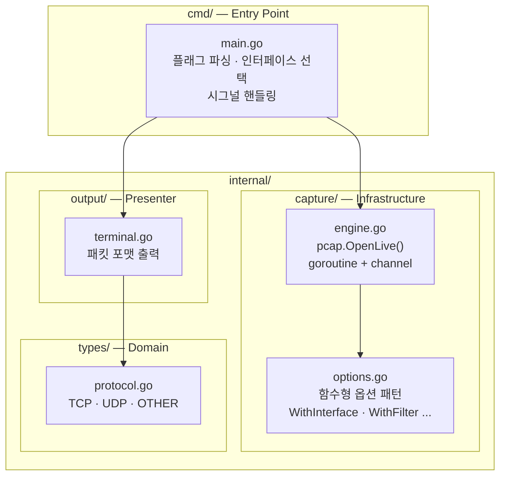
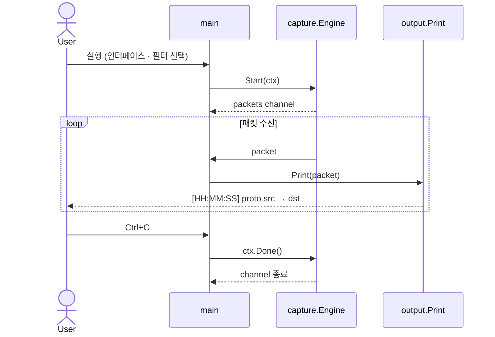

# goscope

`goscope`는 Go로 개발한 CLI 기반 네트워크 패킷 분석 도구입니다.
실시간으로 네트워크 인터페이스의 패킷을 캡처하고, BPF 필터를 통해 원하는 트래픽만 골라 터미널에 출력하거나 `.pcap` 파일로 저장할 수 있습니다.

---

## 주요 기능

- 실시간 패킷 캡처 (promiscuous mode 지원)
- BPF 필터 (`tcp port 80`, `udp`, `host 192.168.0.1` 등)
- 터미널 포맷 출력 — 시각 · 프로토콜 · 소스/목적지 IP:Port
- `.pcap` 파일 저장 (Wireshark 호환)
- 인터랙티브 인터페이스 선택 (`-i` 미지정 시 목록 표시)
- Ctrl+C 시 안전한 종료 (graceful shutdown)

---

## 요구 사항

| 항목 | 버전 |
|------|------|
| Go | 1.25+ |
| libpcap (Linux/macOS) | 1.x |
| Npcap / WinPcap (Windows) | 최신 버전 |

> **Windows**: [Npcap](https://npcap.com/) 설치 필요
> **Linux**: `sudo apt install libpcap-dev` 또는 `sudo yum install libpcap-devel`
> **macOS**: `brew install libpcap`

---

## 설치 및 빌드

```bash
git clone https://github.com/kwon93/goscope.git
cd goscope
go build -o goscope ./cmd/main.go
```

---

## 사용법

```
goscope [옵션]
```

| 플래그 | 설명 | 기본값 |
|--------|------|--------|
| `-i <iface>` | 캡처할 네트워크 인터페이스 이름 | 인터랙티브 선택 |
| `-f <filter>` | BPF 필터 표현식 | (없음, 전체 캡처) |
| `-w <file>` | 저장할 `.pcap` 파일명 | 인터랙티브 입력 |

### 예시

```bash
# 인터페이스 목록에서 선택 후 캡처
sudo ./goscope

# eth0에서 HTTP 트래픽만 캡처
sudo ./goscope -i eth0 -f "tcp port 80"

# 파일로 저장
sudo ./goscope -i eth0 -f "tcp port 443" -w tls.pcap

# UDP 트래픽만 터미널 출력
sudo ./goscope -i en0 -f udp
```

> Linux/macOS에서는 `sudo` 또는 `CAP_NET_RAW` 권한이 필요합니다.

### 출력 형식

```
패킷 캡쳐 시작 (Ctrl+C를 눌러 종료하세요)
[14:32:01] TCP  192.168.0.5:54321 -> 443 → 93.184.216.34
[14:32:01] UDP  192.168.0.5:53    -> 53  → 8.8.8.8
[14:32:02] OTHER 10.0.0.1 → 10.0.0.255
```

---

## 아키텍처

### 레이어 구조



### 실행 흐름 시퀀스



## 프로젝트 구조

```
goscope/
├── cmd/
│   └── main.go                  # 진입점: 플래그 파싱, 인터페이스 선택, 시그널 처리
├── internal/
│   ├── capture/
│   │   ├── engine.go            # pcap 캡처 엔진 (고루틴 기반 채널 스트림)
│   │   └── options.go           # 함수형 옵션 패턴 (WithInterface, WithFilter)
│   ├── output/
│   │   └── terminal.go          # 패킷 포맷 출력
│   └── types/
│       └── protocol.go          # 프로토콜 타입 정의 (TCP, UDP, OTHER)
└── docs/
    ├── go-conventions.md         # Go 코딩 컨벤션
    └── go-cli-clean-architecture.md  # 클린 아키텍처 가이드
```

---

## 의존성

| 패키지 | 역할 |
|--------|------|
| `github.com/google/gopacket` | 패킷 파싱 및 pcap 핸들링 |

---

## 라이선스

MIT
