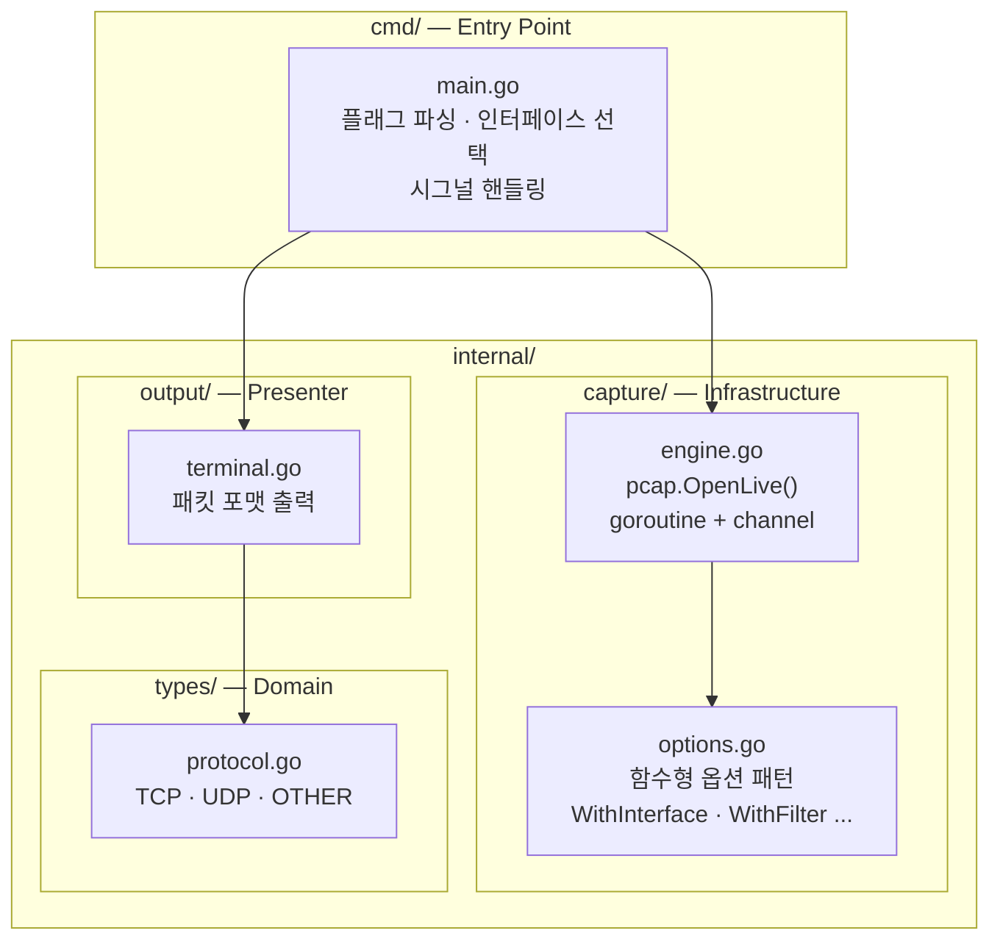
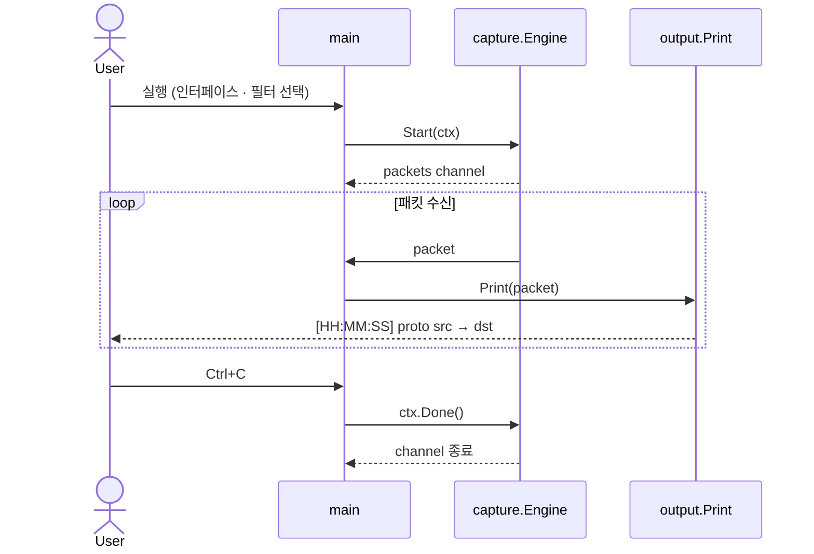

# Overall Architecture

## 레이어 구조



## 실행 흐름 시퀀스



## 프로젝트 구조

```
goscope/
├── cmd/
│   └── main.go                  # 진입점: 플래그 파싱, 인터페이스 선택, 시그널 처리
├── internal/
│   ├── capture/
│   │   ├── engine.go            # pcap 캡처 엔진 (고루틴 기반 채널 스트림)
│   │   └── options.go           # 함수형 옵션 패턴 (WithInterface, WithFilter)
│   ├── output/
│   │   └── terminal.go          # 패킷 포맷 출력
│   └── types/
│       └── protocol.go          # 프로토콜 타입 정의 (TCP, UDP, OTHER)
└── docs/
    ├── overall-architecture.md       # 전체 아키텍처 (현재 문서)
    ├── go-conventions.md             # Go 코딩 컨벤션
    └── go-cli-clean-architecture.md  # 클린 아키텍처 가이드
```

## 의존성

| 패키지 | 역할 |
|--------|------|
| `github.com/google/gopacket` | 패킷 파싱 및 pcap 핸들링 |
