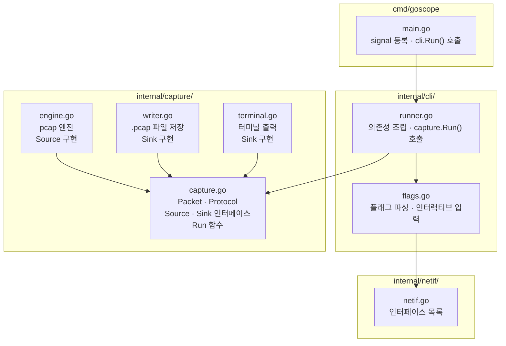
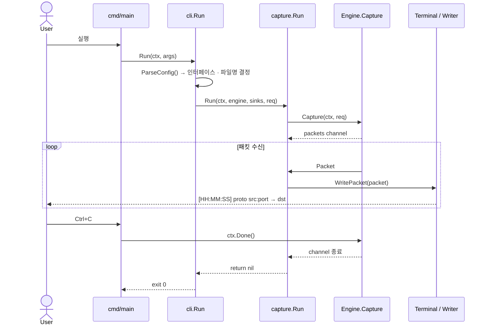

# Overall Architecture

## 패키지 구조

```
cmd/goscope/
  main.go              # 진입점: signal 등록, cli.Run() 호출

internal/
  capture/
    capture.go         # Packet · Protocol 타입, Source/Sink 인터페이스, Run 함수
    engine.go          # pcap 엔진 (Source 구현)
    writer.go          # .pcap 파일 저장 (Sink 구현)
    terminal.go        # 터미널 출력 (Sink 구현)
  cli/
    flags.go           # 플래그 파싱, 인터랙티브 입력
    runner.go          # 의존성 조립, capture.Run() 호출
  netif/
    netif.go           # 네트워크 인터페이스 목록
```

## 의존 관계

```
cmd/goscope → cli → capture
                  → netif
```

- `capture` 패키지가 타입, 인터페이스, 구현체를 모두 소유한다.
- `cli` 는 `capture` 와 `netif` 만 알면 된다.
- `cmd` 는 `cli` 만 호출한다.



## 실행 흐름



## 핵심 설계 원칙

### 인터페이스는 사용하는 쪽에 정의한다

`capture` 패키지가 자신에게 필요한 인터페이스를 직접 선언한다.
구현체(`Engine`, `Writer`, `Terminal`)는 같은 패키지 안에 있어도 무관하다.

```go
// capture/capture.go
type Source interface {
    Capture(ctx context.Context, req Request) (<-chan Packet, error)
}

type Sink interface {
    WritePacket(ctx context.Context, pkt Packet) error
}
```

### 핵심 로직은 함수로 표현한다

유스케이스를 struct + Run 메서드 대신 일반 함수로 표현한다.

```go
// capture/capture.go
func Run(ctx context.Context, src Source, sinks []Sink, req Request) error
```

### gopacket 타입은 capture 밖으로 노출하지 않는다

`engine.go` 안에서만 gopacket을 사용하고, 변환된 `Packet` struct만 외부에 전달한다.

## 의존성 규칙

| 패키지 | gopacket import | pcap import | flag import |
|--------|:-:|:-:|:-:|
| `capture/capture.go` | 금지 | 금지 | 금지 |
| `capture/engine.go` | 허용 | 허용 | 금지 |
| `capture/writer.go` | 허용 | 금지 | 금지 |
| `capture/terminal.go` | 금지 | 금지 | 금지 |
| `cli/` | 금지 | 금지 | 허용 |
| `netif/` | 금지 | 허용 | 금지 |
| `cmd/` | 금지 | 금지 | 금지 |

## 외부 의존성

| 패키지 | 역할 |
|--------|------|
| `github.com/google/gopacket` | 패킷 파싱 및 pcap 핸들링 |
