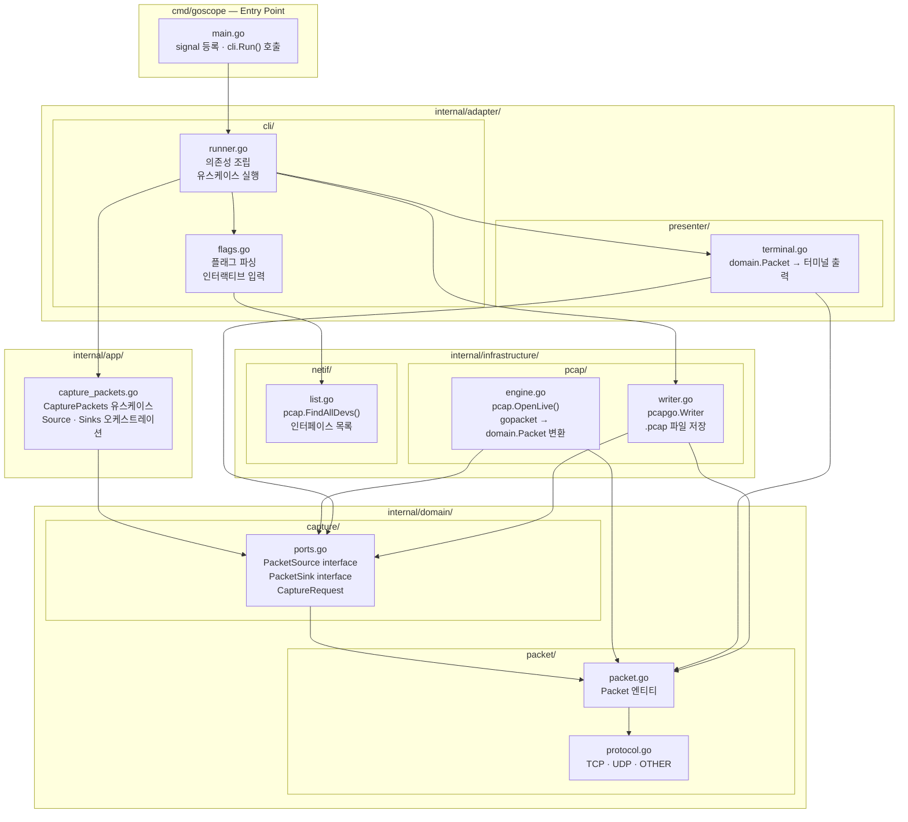
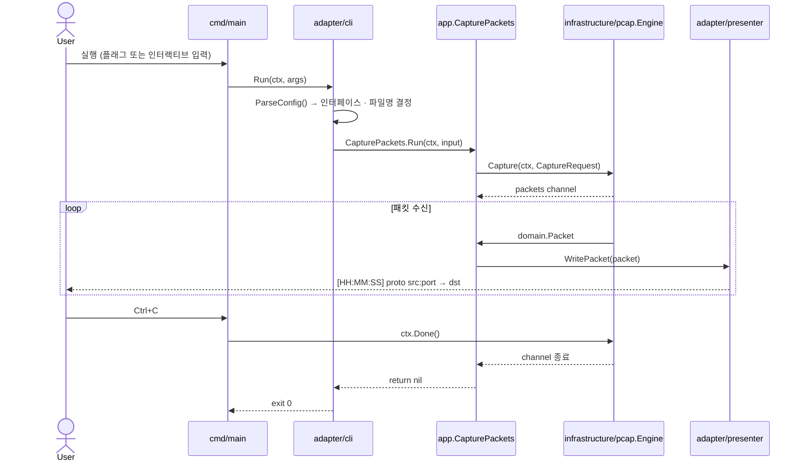

# Overall Architecture

## 레이어 구조

의존성은 항상 바깥에서 안쪽으로만 향한다.

```
cmd → adapter/cli → app → domain ← adapter/presenter ← infrastructure
```



## 실행 흐름 시퀀스



## 프로젝트 구조

```
goscope/
├── cmd/
│   └── goscope/
│       └── main.go                        # 진입점: signal 등록, cli.Run() 호출
│
├── internal/
│   ├── domain/                            # 순수 도메인 — 외부 라이브러리 import 없음
│   │   ├── packet/
│   │   │   ├── packet.go                  # Packet 엔티티
│   │   │   └── protocol.go                # Protocol 타입 (TCP · UDP · OTHER)
│   │   └── capture/
│   │       └── ports.go                   # PacketSource · PacketSink 인터페이스, CaptureRequest
│   │
│   ├── app/                               # 유스케이스 — pcap 직접 import 없음
│   │   └── capture_packets.go             # CapturePackets: Source → Sinks 오케스트레이션
│   │
│   ├── adapter/                           # 외부 입출력 변환
│   │   ├── cli/
│   │   │   ├── flags.go                   # 플래그 파싱, 인터랙티브 프롬프트
│   │   │   └── runner.go                  # 의존성 조립, 유스케이스 실행
│   │   └── presenter/
│   │       └── terminal.go                # domain.Packet → 터미널 한 줄 출력
│   │
│   └── infrastructure/                    # 외부 라이브러리 · OS 직접 접근
│       ├── pcap/
│       │   ├── engine.go                  # pcap.OpenLive(), gopacket → domain.Packet 변환
│       │   └── writer.go                  # pcapgo.Writer, .pcap 파일 저장
│       └── netif/
│           └── list.go                    # pcap.FindAllDevs(), 인터페이스 목록
│
└── docs/
    ├── overall-architecture.md            # 전체 아키텍처 (현재 문서)
    ├── go-conventions.md                  # Go 코딩 컨벤션
    └── go-cli-clean-architecture.md       # 클린 아키텍처 가이드
```

## 의존성 규칙

| 레이어 | gopacket import | pcap import | flag import |
|--------|:-:|:-:|:-:|
| `domain/` | 금지 | 금지 | 금지 |
| `app/` | 금지 | 금지 | 금지 |
| `adapter/cli/` | 금지 | 금지 | 허용 |
| `adapter/presenter/` | 금지 | 금지 | 금지 |
| `infrastructure/pcap/` | 허용 | 허용 | 금지 |
| `infrastructure/netif/` | 금지 | 허용 | 금지 |
| `cmd/` | 금지 | 금지 | 금지 |

## 외부 의존성

| 패키지 | 역할 |
|--------|------|
| `github.com/google/gopacket` | 패킷 파싱 및 pcap 핸들링 |
